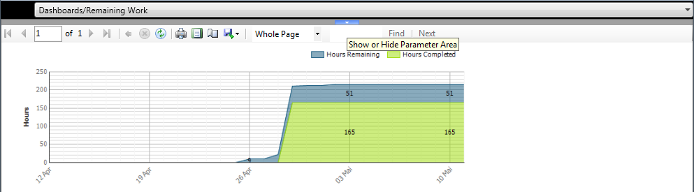

Quick Start


Table of Contents

System Requirements
===================

-   Windows XP SP2 or later, Windows Vista Business edition or higher,
    x86 (32bit) and x64 (64bit) editions, Windows 7

-   Team Foundation Explorer 2010

-   Team Foundation Server 2010

Installation Manual
===================

To install the AIT TeamSystemPro Task Board, unpack the file AIT.Task
board.zip and execute AIT.Task board.Application.application. The
following screen will appear:


Click on *Install* to start the setup. When the installation succeeds
the AIT Task Board application will start.

General user interface description
==================================

The task board consists of three areas:

-   Ribbon which allows interaction with the task board

-   Report control to display reports from projects reporting portal

-   Task board control to visualize work items.

Between report and task board area is a splitter that allows hiding
either the report area or the task board area.

The ribbon can be minimized and maximized by double clicking the *Home*
ribbon tab.


Caption 1: Task board view

Ribbon Usage
============


Connect 
-------

Click on *Connect* to connect to your Team Foundation Server. When
clicking Connect to TFS the following dialog will be shown which allows
you to select your Team Project Collection and your Team Project.


Caption 2: Select Team Project Collection and Team Project

Open
----

Click *Open* to open an existing task board configuration.

New 
----

Select *New* to create a new task board configuration. After choosing
your file the Settings dialog will be shown.

Edit 
----

Select *Edit* in order to configure your task board settings.


Caption 3: Task board Settings Dialog

In the *Backlog Items* list choose the work item types you consider as
backlog items. These work item types will be shown on the left side in
the task board. By default your process template is checked for
categories Bugs and Requirements in order to determine the work item
types. If the categories do not exist no pre-selection will be done and
you need to choose your items manually.

In the *Child Items* list choose the work item types you consider as
children of your backlog items. These work item types will be shown in
the task board grouped by their state. By default your process template
is checked for Task work item types. If Task work item types exists the
will be preselected, otherwise you need to choose your items manually.

In the *States* section you can define your own states (we refer to
these states as *Custom States*). For each state you configure which
work item states it should refer to. Because it is possible to select
different work item types as child items which can have different state
models multiple work item state assignments might be required. By
default the following states are created:

-   *Pending* state is created if a *Proposed* work item state exists

-   *In Work* state is created if an *Active* work item state exists

-   *Done* is created if a *Resolved* work item state exists

You can rename the states by selecting it with the mouse and enter a new
name. You can change the color of a state by choosing the Button “…”
which will open a color picker that allows you to select a color.

The buttons between the lists have the following purpose:

  Symbol                     |Description
  ---------------------------|------------------------------------------------
      |Adds a new Custom State to the list.
     |Removes the selected Custom State from the list.
     |Moves the selected Custom State up in the list.
     |Moves the selected Custom State down in the list.

The drop down *Query* allows you to select a query from your Team
Project. Any filtering or sorting should be applied in the query. In
order to correctly leverage the features of the task board you should
consider selecting a hierarchical query which is either a tree query or
a direct link query.

**Attention:** *If the query does **not** **return** any **link
information** the task board visualization **will not work**.
Additionally the query defines the fields that could be edited in the
work item edit bar. Some numeric fields are black listed* [^1]*in the
software and will never be editable in the edit bar.*

The drop down *Link Type* allows you to select a specific work item link
type. If a specific work item link type is defined then only links of
that type are considered between backlog items and child items.

The drop downs *Item Sorting* allow you to define a specific item
sorting together with the sort direction. If *None* is defined the
sorting from the query is kept.

The drop down *Row Summary* allows you to define which values to choose
in order to determine the Row Summary (see Row Summary for more
details). Only numeric fields returned by the query are considered.

The drop down *Column Summary* allows you to define which values to
choose in order to determine the Column Summary (see Column Summary for
more). Only numeric fields returned by the query are considered.

When clicking OK your changes are accepted and the task board is
refreshed.

Publish
-------

Click on the *Publish* icon to save changes you made to any of the work
items in the task board.

Refresh
-------

Click on the *Refresh* button in order to refresh the work items
according to your configured work item query.

Style
-----

The AIT TeamSystemPro Task Board allows you to specify the style used to
visualize work items. When clicking the *Style* button you can choose
your work item styles. For more information about extending the work
item visualization see chapter 7 “Extending the work item
visualization”.

Assigned To
---------------------------------------------------------------------------------------------------------

The combo box *Assigned To* allows you to filter the task board for
certain users. Only items being assigned to the chosen user will be
shown. Also the row summary will highlight the row summary value
matching the user in contrast to the total row summary values (see Row
Summary for more details).

Full Screen
-----------

Click the *Full Screen* button in order to switch to full screen mode.
Press *ESC* key to return to normal screen mode.

Zoom In
-------

Click the *Zoom In* button in order to zoom in which means to increase
the size of the work item visualizations.

Zoom Out
--------

Click the *Zoom Out* button in order to zoom out which means to decrease
the size of the work item visualizations.

Help
----

Click the *Help* button in order to show this document.

About
-----

Click the *About* button in order to show information about the
application.

Task board Usage
================


Caption 4: Work Items visualized in Task board

According to you configuration the task board visualizes your work
items. The task board comes with a predefined set of work item type
visualizations. For customized work item visualizations [contact
us](mailto:info@aitag.com?subject=AIT%20Taskboard:%20Work%20Item%20Visualization%20Request).

In order get more overview of the whole bunch of work items the task
board allows you to zoom via buttons in the ribbon or via keyboard
shortcuts (CTRL-‘+’ to zoom in, CTRL-‘-‘ to zoom out)


Caption 5: Zoomed Task board

When you select a work item an edit bar is shown which allows you to
quickly modify numeric values returned by your query.


Caption 6: Task board with the selected work item and edit bar

If you want to edit more details of a work item you can either double
click the work item or use the “More” link from the edit bar to open the
work item form. An edited work item is visualized with a dashed border
line


In order to change the state of a work item you can drag it from one
state to another. Dropping a work item on a state is only possible if
the work items state model supports switching to that state.

For each backlog item a summary is shown which we refer to as Row Summary. The row summary shows
a bar that reflects the values for each state. Which value to consider
can be configured in the Settings dialog (See 4.4 Edit )


Caption 7: Row Summary to visualize values from state


Caption : Unfiltered Row Summary


Caption 9: Filtered Row Summary

When the task board is filtered (see 4.8 Assigned To) the bar reflects
in faded colors the overall summary and in normal colors the values for
the person currently filtered.

For each state a summary is shown which we refer to as Column Summary. The column
summary shows a numeric value for each state. Which values to consider
can be configured in the Settings dialog (See 4.4 Edit ).


Caption : Unfiltered Column Summary


Caption : Filtered Column Summary

Reports Usage
=============

The reports control allows you to select any of your team project
related reports via the dropdown. After choosing a report it will be
shown in the report viewer. The report viewer allows you to configure
parameters for your report.


Caption 12: Report control with expanded report parameter panel



Caption 13: Report control with collapsed report parameter panel

Extending the work item visualization
=====================================

The AIT TeamSystemPro Task Board is built on WPF technology. It uses
[Data Templates](http://msdn.microsoft.com/en-us/library/ms742521.aspx)
to define the visual appearance of a work item. The templates must be
packaged in a XAML file containing a resource dictionary:

```xml
<ResourceDictionary xmlns="http://schemas.microsoft.com/winfx/2006/xaml/presentation" xmlns:x="http://schemas.microsoft.com/winfx/2006/xaml">
  ...
</ResourceDictionary>
```
You can specify a Data Template for each Work Item Type. The Data
Templates must be named using the following naming schema:

\[*WorkItemTypeName*\]WorkItemTemplate

*Where WorkItemTypeName* is the name of the work item type with no white
spaces

The following table shows some samples for work item types and the
corresponding data template keys:

  Work Item Type Name   |Data Template Key
  --------------------- |-----------------------------
  User Story            |UserStoryWorkItemTemplate
  Requirement           |RequirementWorkItemTemplate
  Task                  |TaskWorkItemTemplate

The data context for each work item template is a
[WorkItem][workitem]
object. A simple template for a task work item is shown below:

```xml
<DataTemplate x:Key="TaskWorkItemTemplate">
    <Grid>
        <Grid.ColumnDefinitions>
            <ColumnDefinition Width="Auto" />
            <ColumnDefinition Width="\*" />
        </Grid.ColumnDefinitions>
        <Grid.RowDefinitions>
            <RowDefinition Height="Auto" />
            <RowDefinition Height="\*" />
            <RowDefinition Height="Auto" />
            <RowDefinition Height="Auto" />
        </Grid.RowDefinitions>
        <Image Source="Images\\Task.png" Grid.ColumnSpan="2" Grid.RowSpan="2" Opacity=".2" />
        <Image Source="SmallImages\\forbidden.png" Grid.Column="1" Margin="2" Width="16" Height="16" HorizontalAlignment="Right" >
            <Image.Visibility>
                <Binding Converter="{StaticResource BlockedConverter}" ConverterParameter="Blocked" />
            </Image.Visibility>
        </Image>
        <TextBlock Grid.Column="1" Margin="2" Text="{Binding Path=Id}" />
        <TextBlock Grid.Row="1" Grid.ColumnSpan="2" Margin="2" Text="{Binding Path=Title}" TextTrimming="CharacterEllipsis" TextWrapping="Wrap" />
        <TextBlock Grid.Row="2" Grid.ColumnSpan="2" TextTrimming="CharacterEllipsis">
            <TextBlock.Text>
                <Binding Path="Fields\[Assigned To\].Value" />
            </TextBlock.Text>
        </TextBlock>
        <StackPanel Grid.Row="3" Grid.ColumnSpan="2" Orientation="Horizontal">
            <TextBlock>
                <TextBlock.Text>
                    <Binding Converter="{StaticResource WorkItemNumericFieldValueConverter}" ConverterParameter="Baseline Work" />
                </TextBlock.Text>
            </TextBlock>
            <TextBlock>
                <TextBlock.Text>
                    <Binding Converter="{StaticResource WorkItemNumericFieldValueConverter}" ConverterParameter="Original Estimate" />
                </TextBlock.Text>
            </TextBlock>
            <TextBlock Text=" / " />
            <TextBlock>
                <TextBlock.Text>
                    <Binding Converter="{StaticResource WorkItemNumericFieldValueConverter}" ConverterParameter="Remaining Work" />
                </TextBlock.Text>
            </TextBlock>
            <TextBlock Text=" / " />
            <TextBlock >
                <TextBlock.Text>
                    <Binding Converter="{StaticResource WorkItemNumericFieldValueConverter}" 
                             ConverterParameter="Completed Work" />
                </TextBlock.Text>
            </TextBlock>
        </StackPanel>
    </Grid>
</DataTemplate>
```

The above template uses a set of converters to retrieve certain values
from the work item. In order to use the converters shipped with the AIT
TeamSystemPro Task Board you need to include those as follows:

```xml
<ResourceDictionary 
    xmlns="http://schemas.microsoft.com/winfx/2006/xaml/presentation"
    xmlns:x="http://schemas.microsoft.com/winfx/2006/xaml"
    xmlns:converter="clr-namespace:AIT.Taskboard.Application.Converter;assembly=AIT.Taskboard.Application">
    
    <converter:BlockedConverter x:Key="BlockedConverter" />
    <converter:TimeInStateConverter x:Key="TimeInStateConverter" />
    <converter:UserNameToImageConverter x:Key="UserNameToImageConverter" />
    <converter:WorkItemNumericFieldValueConverter x:Key="WorkItemNumericFieldValueConverter" />
</ResourceDictionary>
```

The AIT TeamSystemPro Task board is shipped with the following set of
converters:

-   BlockedConverter

-   BooleanToVisibilityConverter

-   StringNullVisibilityConverter

-   TimeInStateConverter

-   UserNameToImageConverter

-   WorkItemNumericFieldValueConverter

-   FieldValueVisibilityConverter

In order to control the size of the work items elements in the task
board you can add two double resources to you resource dictionary as
follows:

```xml
<s:Double x:Key="TemplateWidth">160</s:Double>
```
```xml
<s:Double x:Key="TemplateHeight">120</s:Double>    
```

It’s important to use the right names for those two resources –
*TemplateHeight* and *TemplateWidth*.

BlockedConverter
----------------

The *BlockedConverter* is used to convert the values of the Blocked
field into a Visibility value.

```xml
<Image Source="SmallImages\\forbidden.png" Grid.Column="1" Margin="2" Width="16" Height="16" \
       HorizontalAlignment="Right">\
    <Image.Visibility>\
        <Binding Converter="{StaticResource BlockedConverter}" ConverterParameter="Blocked" />\
    </Image.Visibility>\
</Image>
```

The *BlockedConverter* requires as ConverterParameter the name of the
field to evaluate. The field specified should have *Yes* or *No* as
value. If the field’s value is *Yes* *Visibility.Visible* is retruned,
otherwise *Visibility.Hidden* is returned.

Although the converter is named *BlockedConverter* it allows you to work
with any field that has *Yes/No* values.

BooleanToVisibilityConverter
----------------------------

As the name implies the *BooleanToVisibilityConverter* converts a
Boolean value into a Visibility value. The converter can be used when
binding to Boolean value. The converter allows to configure which
visibility to return for which Boolean value:

```xml
<converter:BooleanToVisibilityConverter x:Key="HiddenIfNotTrue" Inverted="True" Not="False" OnTrue="Visible" OnFalse="Hidden" />
```

The BooleanToVisibilityConverter has the following parameters:

  |Parameter   |Description
  |----------- |------------
  |Inverted    |A Boolean value. When set to *True* the conversion is from Visibility to Boolean which means the value bound is a Visibility value and the converted value will be a Boolean. Otherwise the conversion will be from Boolean to visibility. The default value is *False*
  |Not         |A Boolean value. If set to true the bound Boolean value is logical negotiated before using it to determine the visibility. The default value is *False.*
  |OnTrue      |The visibility to return when the input value – after applying the *Not* configuration – is evaluated as *True*.
  |OnFalse     |The visibility to return when the input value – after applying the *Not* configuration – is evaluated as *False*.
  
StringNullVisibilityConverter
-----------------------------

The *StringNullVisibilityConverter* can be used when binding to strings.
It returns *Visibility.Visible* when the bound string value is neither
null nor empty. Otherwise it returns *Visibility.Hidden*.

TimeInStateConverter
--------------------

The TimeInStateConverter is a sample that shows how a converter can be
used to perfrom specifc calculation logic for the visualization based on
the bound work item. It can be used as follows:

```xml
<TextBlock Text="{Binding Converter={StaticResource TimeInStateConverter}, ConverterParameter=TotalHours, StringFormat={}{0:F0} }" />
```

The Converter is looking for fields in the work item that track the
Enter Time for a state. These fields are named *\[StateName\] Enter
Time*. The State Name is evaluated on the bound work item using the work
items current state. If an Enter Time field is found for the current
state the difference between that field’s value and DateTime.Now is
calculated. Based on the ConverterParameter Minutes, Hours or Days are
returned. The allowed ConverterParamters are *TotalDays*, *TotalHours*
and *TotalMinutes*. If no parameter is specified or an invalid parameter
is specified the Timespan value is returned.

UserNameToImageConverter
------------------------

The *UserNameToImageConverter* tries to find images for users. It can be
used when being bound to a string value. The converter is looking for
user images in the execution directory. The images should be named
\[*UserName*\].png where *UserName* matches the bound string value. If
no user image is found the converter returns one of the default images.

WorkItemNumericFieldValueConverter
----------------------------------

The WorkItemNumericFieldConverter converts a numeric field value. Its
fails safe if the field does not exist or the field has no value. If the
field exists but has no value 0 (zero) is returned.

```xml
<TextBlock>
    <TextBlock.Text>
        <Binding Converter="{StaticResource WorkItemNumericFieldValueConverter}" 
                 ConverterParameter="Original Estimate" />
    </TextBlock.Text>
</TextBlock>
```

The converter must be bound to the work item instance and expects as
ConverterParamter the name of the field.

FieldValueVisiilityConverter
----------------------------

The *FieldValueVisibilityConverter* allows you set the visibility of an
item based on the value of a work item field.

The following shows how the *FieldValueVisibilityConverter* is
integrated:

```xml
<converter:FieldValueVisibilityConverter x:Key="FieldValueVisibilityConverter" MatchedVisibility="Visible" UnmatchedVisibility="Hidden" />
```

The following shows how the converter is applied to set the visibility
of an image based on the value of a work item field.

```xml
<Image Source="SmallImages\\forbidden.png" Grid.Column="1" Margin="2" Width="16" Height="16" HorizontalAlignment="Right">
    <Image.Visibility>
        <MultiBinding Converter="{StaticResource FieldValueVisibilityConverter}" ConverterParameter="Microsoft.VSTS.CMMI.RequirementType">
            <Binding />
            <Binding Source="{StaticResource AllowedRequirementTypeFunctional}" />
            <Binding Source="{StaticResource AllowedRequirementTypeBusiness}" />
        </MultiBinding>
    </Image.Visibility>
</Image>
```

The first value in the multi binding is always the work item. The
following bindings refer to the values to check. If either of the values
is set in the field the visibility is set to the configured
*MatchedVisibility*, otherwise the *UnmatchedVisibility* is set. The
field that should be check is specified via the *ConverterParameter.*

[^1]: Black listed fields are "Iteration ID", "IterationID", "Area ID",
    "AreaID", "ParentWI", "FirstChildWI", "NextWI", "Proposed Enter
    Completed Work", "Development Enter Completed Work", "Test Enter
    Completed Work", "Deployment Enter Completed Work", "Proposed Leave
    Completed Work", "Development Leave Completed Work", "Test Leave
    Completed Work", "Deployment Leave Completed Work"

[workitem]:http://msdn.microsoft.com/en-us/library/microsoft.teamfoundation.workitemtracking.client.workitem(VS.80).aspx